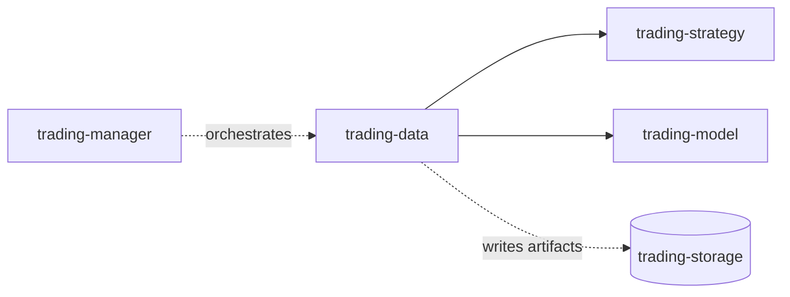

# trading-data

`trading-data` is the code-first upstream data repository for the trading stack.
It owns source adapters, fetch/build entrypoints, canonical data contracts, and artifact-readiness signals.
It does **not** own cross-repo orchestration policy.

## Role in the stack

## Owns
- market-data acquisition and normalization
- source-specific adapters under `src/`
- stable manager-facing fetch/build entrypoints
- canonical retained-artifact contracts
- artifact-readiness signal emission
- market-regime benchmark/context data acquisition
- macro / calendar dataset acquisition

## Does not own
- scheduling / queue policy
- cross-repo workflow sequencing
- control-plane retry / lifecycle policy
- strategy simulation
- model ranking / promotion policy
- live execution

## Canonical inputs
- external data-source responses (Alpaca primary; other sources optional)
- repo config under `config/`
- source credentials via local environment

## Canonical outputs
- market-tape artifacts under `trading-storage/2_market_tape/`
- market-regime artifacts under `trading-storage/1_market_regime/`
- readiness signals under `trading-storage/1_market_regime/0_permanent/8_signals/`

## Current mainline contract
- Alpaca is the primary source for retained market-tape data
- retained market-tape partitions are symbol/month scoped
- canonical retained tape datasets are minute-level by default:
  - `bars_1min.jsonl`
  - `quotes_1min.jsonl`
  - `trades_1min.jsonl`
- low-frequency macro/economic datasets remain append/upsert context artifacts rather than symbol/month tape
- benchmark ETFs/proxies are part of the market-regime layer, not a separate orchestration system
- `trading-storage` is now the canonical durable destination; repo-local `data/` wording is legacy only

## Current status
- storage write paths have been repathed to `trading-storage`
- signal output has been repathed to `trading-storage/1_market_regime/0_permanent/8_signals/`
- compaction / normalize tools now target `trading-storage` instead of repo-local `data/`
- remaining work is mostly contract cleanup and validation rather than topology redesign

## Read in order
1. `docs/README.md`
2. `docs/01-overview.md`
3. `docs/02-storage-contracts-and-partitions.md`
4. `docs/03-context-layer-and-holdings.md`
5. `docs/04-refresh-entrypoints-and-signals.md`
6. `docs/05-current-status-and-open-decisions.md`
7. `docs/06-macro-data.md`
8. `docs/07-market-regime-benchmarks.md`

## Next work
See `TODO.md`.
