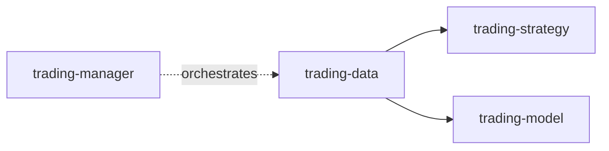
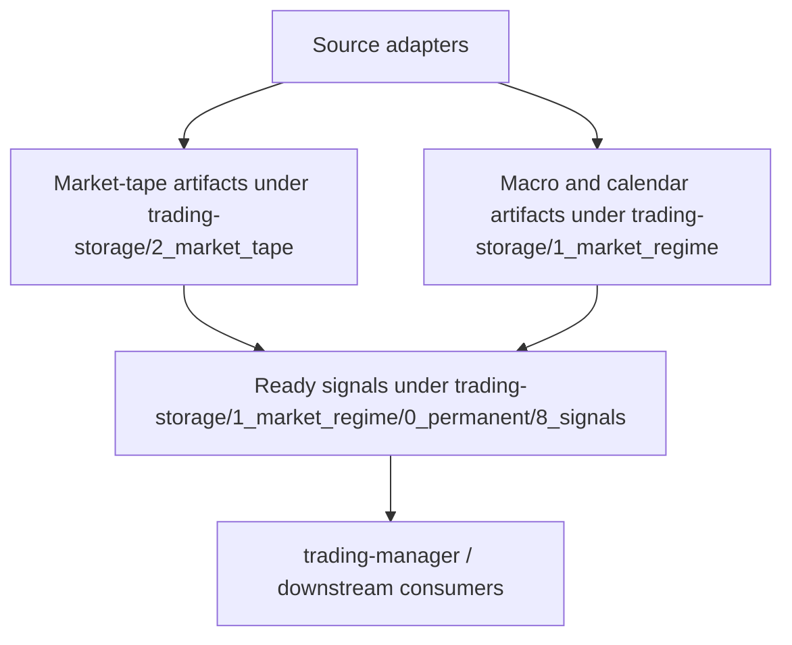

# trading-data

`trading-data` is the canonical upstream market-data repository for the trading stack.
It acquires and normalizes market/context data, stores canonical monthly partitions, and exposes stable refresh/build entrypoints that `trading-manager` can call.

## Scope

**Owns**
- market-data acquisition
- source adapters and data-maintenance code
- raw partitioning and storage policy
- canonical data-layer contracts
- ETF/context proxy artifacts
- stable data refresh/build entrypoints
- readiness signals for completed artifacts

**Does not own**
- cross-repo scheduling/timing policy
- queue/control-plane state
- strategy simulation
- model training/ranking logic
- live execution
- cross-repo archive/rehydration policy ownership

## Stack position

## Required inputs
- external API/source responses from Alpaca
- repo config under `config/*.json`
- source credentials via repo-local environment

## Optional inputs
- OKX API responses
- Bitget API responses
- low-frequency macro/economic source responses from FRED, BLS, BEA, Census, and Treasury Fiscal Data
- Federal Reserve official webpage/RSS/calendar event sources

## Primary outputs
- `trading-storage/2_market_tape/1_long_retention/1_bars/<symbol>/<YYMM>/bars_1min.jsonl`
- `trading-storage/2_market_tape/1_long_retention/2_quotes/<symbol>/<YYMM>/quotes_1min.jsonl`
- `trading-storage/2_market_tape/1_long_retention/3_trades/<symbol>/<YYMM>/trades_1min.jsonl`
- `trading-storage/2_market_tape/1_long_retention/4_news/<symbol>/<YYMM>/news.jsonl` when present
- `trading-storage/2_market_tape/1_long_retention/5_options_snapshots/<symbol>/<YYMM>/options_snapshots.jsonl` when present
- `trading-storage/1_market_regime/0_permanent/1_macro/fred/<series>.jsonl`
- `trading-storage/1_market_regime/0_permanent/1_macro/bls/<series>.jsonl`
- `trading-storage/1_market_regime/0_permanent/1_macro/bea/<series>.jsonl`
- `trading-storage/1_market_regime/0_permanent/1_macro/census/<dataset>.jsonl`
- `trading-storage/1_market_regime/0_permanent/1_macro/treasury/<dataset>.jsonl`
- `trading-storage/1_market_regime/0_permanent/7_events_and_calendars/*.jsonl`

## Completion artifacts
- `trading-storage/1_market_regime/0_permanent/8_signals/*.json`
  - `market_data_ready...json`

## Data flow

## Current mainline direction

- Alpaca is the primary long-term source and current architectural mainline
- OKX and Bitget are supplemental / backup sources
- monthly market-tape partitions are the canonical retained market input layer
- the retained market-tape contract is minute-level by default:
  - `bars_1min.jsonl`
  - `quotes_1min.jsonl`
  - `trades_1min.jsonl`
- `quotes_1min.jsonl` and `trades_1min.jsonl` are minute aggregates, not raw event-tape persistence
- low-frequency macro/economic data should be treated as context artifacts rather than symbol/month tape
- macro/economic series should prefer full-history append/upsert storage per series rather than market-tape-style month partitioning
- ETF proxies should be treated as market-regime / sector-rotation / thematic-divergence context instruments via their own retained bar data
- downstream artifact readiness is signaled through machine-readable signal files

## Documentation

Read in order:
1. `docs/README.md`
2. `docs/01-overview.md`
3. `docs/02-storage-contracts-and-partitions.md`
4. `docs/03-context-layer-and-holdings.md`
5. `docs/04-refresh-entrypoints-and-signals.md`
6. `docs/05-current-status-and-open-decisions.md`
7. `docs/06-macro-data.md`
8. `docs/07-market-regime-benchmarks.md`
