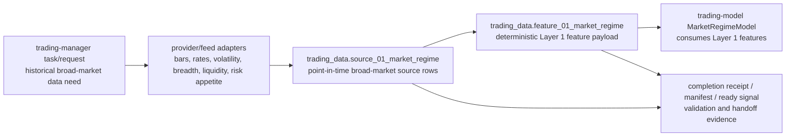

# Layer 01 - Market Regime Data

This file records the `trading-data` responsibility for Layer 1. It is intentionally narrow: model interpretation belongs to `trading-model`, and global naming authority belongs to `trading-manager`.

## Owned artifacts

```text
trading_data.source_01_market_regime
trading_data.feature_01_market_regime
```

`source_01_market_regime` owns point-in-time broad-market source rows. `feature_01_market_regime` owns deterministic point-in-time feature payloads consumed by `model_01_market_regime`.

## Input boundary

Layer 1 data may use broad and cross-asset market evidence such as market ETF bars, rates/duration proxies, dollar/commodity proxies, volatility, correlation, breadth, concentration, credit, liquidity, and risk-appetite sensors.

Layer 1 data must not use sector/industry ETF leadership, sector rotation, ETF holdings, selected securities, strategy labels, option-contract outcomes, portfolio PnL, or future-return labels as construction inputs.

`sector_observation_etf` evidence is not Layer 1 input. Sector/industry behavior evidence routes to `feature_02_sector_context`.

## Field naming

Raw/source columns may use clear provider or observation names without a layer prefix when they are generic facts, for example `available_time`, `symbol`, `open`, `high`, `low`, `close`, and `volume`.

Layer-owned feature or model-facing keys use canonical compact prefixes when they represent Layer 1 concepts, for example `1_transition_pressure` and `1_data_quality_score`. Do not introduce `layer01_*` aliases for the same concept.

## Stage flow



## Layer acceptance

Layer 1 data changes are acceptable when they:

- keep acquisition historical and point-in-time;
- preserve the broad-market-only boundary and exclude sector rotation, ETF holdings, selected securities, strategy labels, option outcomes, portfolio PnL, and future-return labels;
- write source/feature outputs to reviewed SQL contracts or ignored development `storage/` paths only where legacy runtime output is still accepted;
- produce validation, row-count, provenance, and completion evidence without committing generated data or secrets;
- route new shared fields, statuses, task-key fields, source names, or feature names through `trading-manager/scripts/` before cross-repository dependence.

Current verification:

```bash
git status --short
find docs -maxdepth 1 -type f | sort
find . -maxdepth 2 -type f | sort
git diff --check
```
