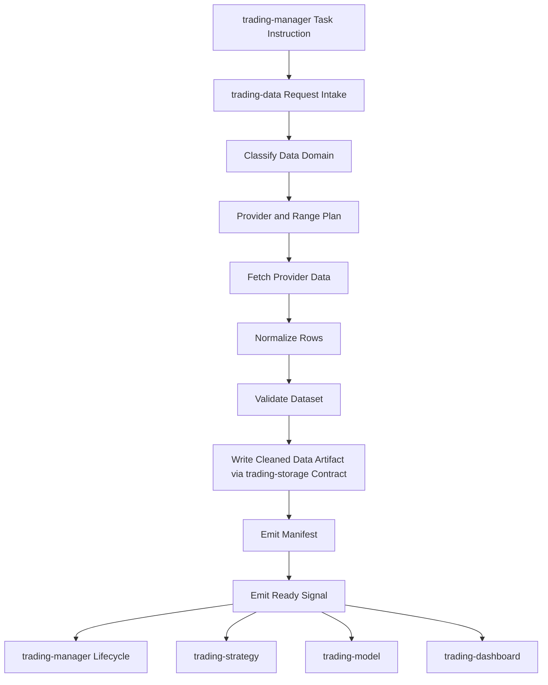

# Workflow

## Purpose

This file defines the intended data-production workflow for `trading-data`.

It describes how approved data requests become validated data artifacts, manifests, and ready signals without leaking provider-specific details into downstream repositories.

## Data Production Flow

```text
manager request -> classify data domain -> plan sources -> fetch -> normalize -> validate -> write cleaned artifact -> emit manifest -> emit ready signal
```

Where:

- **manager request** describes the required dataset, symbols, time range, granularity, and expected outputs;
- **classify data domain** maps the request to market board data, instrument data, option data, or a rejected/re-scoped request;
- **plan sources** resolves provider choice, source composition, quota/rate-limit strategy, cache/retry behavior, and expected storage target;
- **fetch** calls external providers or approved local sources through documented source connectors;
- **normalize** converts provider-specific responses into accepted data shapes;
- **validate** checks schema, timestamps, completeness, calendars, duplicates, and provider caveats;
- **write artifact** stores durable outputs according to `trading-storage` contracts;
- **emit manifest** records run evidence, inputs, provider/config evidence, validation results, and outputs;
- **emit ready signal** marks whether downstream consumers may use the produced data.

## Collaboration Flow



## Operating Principles

- Data requests should be idempotent where practical.
- Provider responses should be normalized before downstream exposure.
- Validation evidence belongs in manifests, not only logs.
- Downstream repositories should consume artifacts and manifests, not provider internals.
- Storage paths must follow `trading-storage` contracts once those contracts exist.
- Shared fields, statuses, and type names must come from `trading-main/registry/`.
- Live provider calls should be minimized in tests; prefer fixtures, recorded examples, or provider adapters with controlled mocks.

## Provider Boundary

Each provider integration should document:

- supported markets and instruments;
- authentication and secret alias expectations;
- rate limits and quota behavior;
- timestamp/timezone semantics;
- response completeness limitations;
- retry and backoff policy;
- fixture coverage for expected and edge-case responses.

Provider credentials must not be committed.

## Validation Boundary

Validation should eventually cover:

- required columns and types;
- timestamp monotonicity and timezone handling;
- duplicate rows;
- missing bars/quotes/events relative to market calendars;
- symbol normalization;
- provider-specific null/placeholder values;
- output artifact readability by downstream consumers.

Exact validation schemas are not yet accepted.

## Open Gaps

The following workflow details must be defined before implementation depends on them:

- exact request schema for data work;
- request domain classification;
- exact artifact reference format;
- exact manifest schema;
- exact ready-signal schema;
- provider selection and priority rules;
- data-source connector layout and credential alias convention;
- raw vs normalized artifact policy;
- data partitioning strategy;
- fixture storage policy;
- retry/backoff defaults;
- live-provider test policy;
- shared storage root and path contract.
