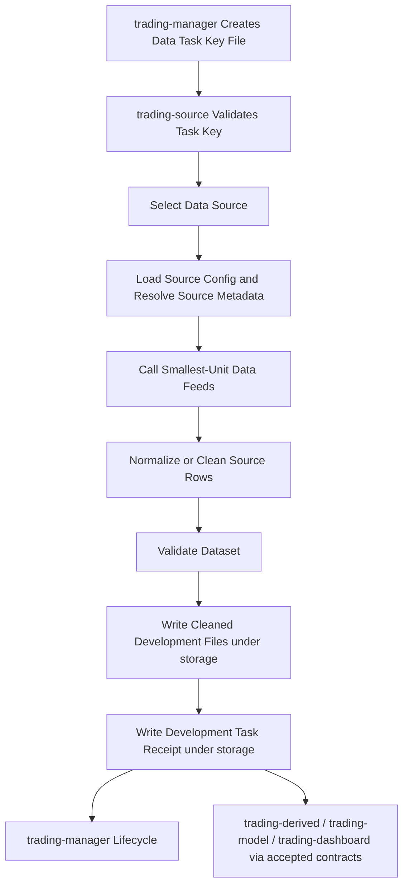

# Workflow

## Purpose

This file defines the intended source-data production workflow for `trading-source`.

It describes how approved source-data requests become validated source-backed SQL outputs/artifacts, manifests, and ready signals without leaking provider-specific details into downstream repositories.

## Data Production Flow

`trading-source` is a historical-data acquisition component. Realtime feeds, live market streaming, and execution-time data handling belong to `trading-execution` unless a later reviewed contract explicitly re-scopes that boundary.

```text
manager task key file -> validate key -> select data source -> load source config -> call smallest-unit data feeds -> normalize/clean -> validate -> write accepted SQL output or legacy development files -> write task receipt
```

Where:

- **manager task key file** is the manager-issued request/control file that contains enough information to complete the task without hidden chat context;
- **validate key** checks task identity, schema version, requested script/source, required parameters, destination expectations, idempotency key, and credential/source references;
- **select data source** invokes the manager-facing source-backed source named by the task key;
- **load source config** resolves stable project parameters such as ETF lists, issuer labels, grains, and detector defaults;
- **call smallest-unit data feeds** calls external providers, official web sources, issuer websites, or approved local feed-output interfaces through documented feed connectors;
- **normalize/clean** converts provider-specific responses and source-backed joins into accepted table-oriented data shapes;
- **validate** checks schema, timestamps, completeness, calendars, duplicates, and provider caveats;
- **write accepted SQL output or legacy development files** stores canonical SQL tables for SQL-only sources and keeps older file-manifest sources under ignored local runtime `storage/` until migrated;
- **write task receipt** records task status and evidence so runs remain inspectable and disposable during development.

Legacy development file outputs use ignored runtime `storage/` paths when a source has not migrated to accepted SQL-only output. The exact task key file schema and durable completion receipt schema remain cross-repository contract work with `trading-main` and `trading-storage`.

## Collaboration Flow



## Operating Principles

- Data acquisition is historical by default; realtime collection is out of scope for this repository.
- Data requests originate from `trading-manager`, not ad hoc local script calls.
- A task key file must be self-contained: no script may depend on missing chat context or implicit operator memory.
- `src/data_feed/` owns smallest-unit provider/source access and source-output normalization.
- `src/data_sources/` owns manager-facing source task execution, source config, cross-source orchestration, and source-backed table generation.
- Sources may call multiple data feeds in one run, but outputs should remain separable by table/data type.
- Data requests should be idempotent where practical.
- Provider responses should be normalized before downstream exposure.
- Validation evidence belongs in completion receipts/manifests, not only logs.
- Downstream repositories should consume storage-backed outputs and receipts/manifests, not provider internals.
- Legacy development file outputs must stay under ignored `storage/`; accepted SQL-only source outputs may use reviewed SQL table contracts and guarded integration paths.
- Shared fields, statuses, and type names must come from `trading-main/scripts/registry/`.
- Live provider calls should be minimized in tests; prefer fixtures, recorded examples, or provider adapters with controlled mocks.


## Task Key File Requirements

The manager-issued task key file should eventually include at least:

- stable task identity;
- requested acquisition script or script source;
- requested data source, output table/category, or feed interface;
- provider/source identifiers;
- symbols, underlyings, ETF identifiers, macro series, calendar scope, or source URLs as applicable;
- historical time range, snapshot timestamp, granularity, timezone, and market/session assumptions;
- source credential aliases or confirmation that no credential is required;
- provider-specific parameters;
- idempotency/replay key;
- stable development output root under `storage/<task-id>/`, plus future storage SQL destination/partition expectations when contracts exist;
- validation expectations;
- task-level development completion receipt destination under `storage/<task-id>/completion_receipt.json`, plus future durable receipt destination when contracts exist;
- priority, deadline, cancellation, and retry expectations when manager scheduling supports them.

The task key file is a contract surface, not an implementation shortcut. Its exact schema must be accepted through `trading-main` before code treats it as stable.


## API Template Design Gate

Before implementation creates a data source folder, the source should be designed from `trading-main/templates/data_tasks/`:

- task key shape;
- source README boundary;
- fetch requirements;
- clean/normalization requirements;
- save/output requirements;
- completion receipt shape;
- fixture/live-call policy;
- default `pipeline.py` shape with `fetch`, `clean`, `save`, and `write_receipt` step functions.

This gate keeps API-specific requirements explicit before code lands while avoiding premature four-file source sprawl.

## Task Runs

A task key is stable. A scheduled or periodic task may run many times with the same task key. Each invocation is a data task run with its own `run_id`, run output directory, status, row counts, and error evidence.

Development output layout should follow:

```text
storage/<task-id>/
  task_key.json
  completion_receipt.json
  runs/
    <run-id>/
      raw/
      cleaned/
      saved/
```

The task-level completion receipt should contain `runs[]` so manager can inspect every run without changing the task key.

## Development Storage Rule

During development, SQL-only sources write to their reviewed SQL target. Legacy source pipelines still use ignored local runtime storage until migrated:

```text
storage/
```

This directory is ignored by Git except for README files. It is intentionally easy to inspect, clear, and recreate. Development outputs, temporary raw responses, cleaned files, manifests, and task receipts should be grouped by stable task id and run id inside this root when implementation begins.

For high-volume raw market data such as trade prints and quote updates, temporary raw segments are only run-local aggregation inputs. Default saved outputs must be aggregate/feature rows aligned to accepted America/New_York time buckets.

SQL writes are canonical only for sources with an explicit SQL output contract; otherwise keep the legacy file path until the source is migrated.

## Historical Source Interfaces and Data Sources

Initial feed interfaces are organized around feed-level output types. Manager-facing orchestration should live in `src/data_sources/`; the feed entries below are the smallest-unit feed modules those sources can call.

| Script / feed | Source | Intended contents | Notes |
|---|---|---|---|
| `01_feed_alpaca_bars` | Alpaca | Historical stock/ETF bars. | Keep separate because bar retrieval has distinct parameters and table shape. |
| `02_feed_alpaca_liquidity` | Alpaca | Liquidity bars. | News is intentionally split out because request shape, cadence, and downstream usage differ from market microstructure events. |
| `03_feed_alpaca_news` | Alpaca | Stock/ETF news. | Standalone feed for news retrieval, article metadata, source/timestamp handling, and final cleaned news outputs. |
| `10_feed_thetadata_option_primary_tracking` | ThetaData | One selected primary/main option contract tracked alongside equity bars/liquidity at the same research grain. | Supplements equity bars/liquidity after contract selection; raw trade/quote/NBBO inputs should aggregate into final tracking rows. |
| `11_feed_thetadata_option_event_timeline` | ThetaData | News-like timeline records for unusual option contract activity. | Event-oriented output, similar to news: timestamped option activity signals rather than bulk raw ticks. |
| `09_feed_thetadata_option_selection_snapshot` | ThetaData | Point-in-time option-chain snapshot visible at signal/selection time. | Simulates what the strategy could know when choosing a contract; use the requested `snapshot_time` as the point-in-time clock and preserve visible contract context. |
| `04_feed_okx_crypto_market_data` | OKX | Historical crypto bars/trades/liquidity. | Quote-derived liquidity fields may be blank when no sampled order-book snapshots exist. |
| `07_feed_trading_economics_calendar_web` | Trading Economics visible calendar page | U.S. high-impact macro calendar rows with Actual, Previous, Consensus, and Forecast. | Accepted replacement for the former `macro_data` official macro API route. Visible page only; no TE API/download/export. |
| `calendar_discovery` | Official web sources discovered by search | FOMC and future calendar scheduling where execution needs it. | Historical macro values now use Trading Economics calendar rows instead of official macro API acquisition. |
| `06_feed_etf_holdings` | ETF issuer websites/files | ETF constituent stocks and weights. | Preserve issuer URL, as-of date, retrieval timestamp, and file format. |

These names are feed-module planning names until accepted through registry/contract review.

## Macro Data Source Rule

`macro_data` is removed as an executable acquisition feed. Macro calendar/value rows for model inputs now come from `07_feed_trading_economics_calendar_web`, using visible Trading Economics page data only.

BLS, BEA, Census, Treasury, FRED, and ALFRED API keys/secret aliases may remain registered and stored for future optional research, but `trading-source` should not route manager tasks to the removed `macro_data` route.

## Completion Receipt Requirements

After each task attempt during development, `trading-source` should write a local completion receipt under `storage/`. Once durable contracts are accepted, this receipt can move through `trading-storage`. The receipt should eventually record:

- task key reference and idempotency/replay key;
- selected script/source and code version;
- started/completed timestamps;
- status and failure reason when applicable;
- provider/source URLs and credential alias evidence without secret values;
- request parameters actually used;
- development file references and future output SQL table/partition references;
- row counts and validation summary;
- retry/rate-limit evidence;
- references to raw/normalized artifacts or manifests if those contracts are accepted.

The receipt belongs in storage, not Git. Exact status fields and storage placement remain pending contract work.

## Provider Boundary

Each provider integration should document:

- supported markets and instruments;
- authentication and secret alias expectations;
- rate limits and quota behavior;
- timestamp/timezone semantics;
- response completeness limitations;
- retry and backoff policy;
- fixture coverage for expected and edge-case responses.

Provider credentials must not be committed.

## Validation Boundary

Validation should eventually cover:

- required columns and types;
- timestamp monotonicity and timezone handling;
- duplicate rows;
- missing bars/quotes/events relative to market calendars;
- symbol normalization;
- provider-specific null/placeholder values;
- output artifact readability by downstream consumers.

Exact validation schemas are not yet accepted.

## Open Gaps

The following workflow details must be defined before implementation depends on them:

- exact task key file/request schema for data work, including release-event keys for macro tasks;
- request domain classification;
- exact artifact reference format;
- exact manifest schema;
- exact ready-signal schema;
- provider selection and priority rules;
- macro release event inventory and feed/source naming rules;
- data-feed connector layout and credential alias convention;
- raw vs normalized artifact policy;
- data partitioning strategy;
- fixture storage policy;
- retry/backoff defaults;
- live-provider test policy;
- development-to-durable promotion rule, storage SQL table/partition contract, and shared storage root/path contract.
