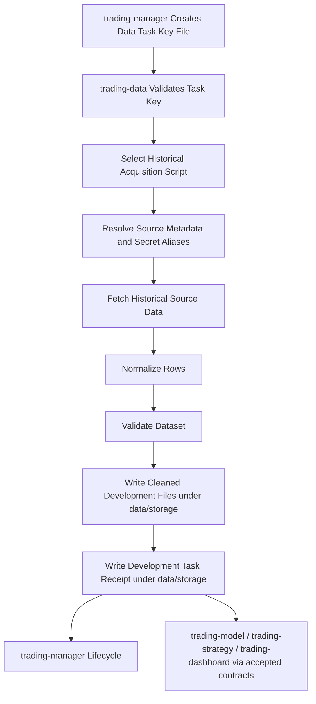

# Workflow

## Purpose

This file defines the intended data-production workflow for `trading-data`.

It describes how approved data requests become validated data artifacts, manifests, and ready signals without leaking provider-specific details into downstream repositories.

## Data Production Flow

`trading-data` is a historical-data acquisition component. Realtime feeds, live market streaming, and execution-time data handling belong to `trading-execution` unless a later reviewed contract explicitly re-scopes that boundary.

```text
manager task key file -> validate key -> classify data domain -> select acquisition script -> fetch historical data -> normalize -> validate -> write development files under data/storage -> write development task receipt under data/storage
```

Where:

- **manager task key file** is the manager-issued request/control file that contains enough information to complete the task without hidden chat context;
- **validate key** checks task identity, schema version, requested script/bundle, required parameters, destination expectations, idempotency key, and credential/source references;
- **classify data domain** maps the task to market board data, instrument data, option data, or a rejected/re-scoped request;
- **select acquisition script** invokes the data-type-specific source script named by the task key;
- **fetch historical data** calls external providers, official web sources, issuer websites, or approved local sources through documented source connectors;
- **normalize** converts provider-specific responses into accepted table-oriented data shapes;
- **validate** checks schema, timestamps, completeness, calendars, duplicates, and provider caveats;
- **write development files under `data/storage/`** stores cleaned outputs in the registered development local storage root instead of writing to SQL;
- **write development task receipt under `data/storage/`** records task status and evidence as a local file so runs remain inspectable and disposable during development.

The development storage root is registered as `TRADING_DATA_DEVELOPMENT_STORAGE_ROOT` with relative path `data/storage`. The exact task key file schema, future SQL table contract, and durable completion receipt schema remain cross-repository contract work with `trading-main` and `trading-storage`.

## Collaboration Flow



## Operating Principles

- Data acquisition is historical by default; realtime collection is out of scope for this repository.
- Data requests originate from `trading-manager`, not ad hoc local script calls.
- A task key file must be self-contained: no script may depend on missing chat context or implicit operator memory.
- Acquisition scripts are grouped by data type and repeated usage bundle, not merely by provider.
- Bundled scripts may fetch multiple related source records in one run, but outputs should remain separable by table/data type.
- Data requests should be idempotent where practical.
- Provider responses should be normalized before downstream exposure.
- Validation evidence belongs in completion receipts/manifests, not only logs.
- Downstream repositories should consume storage-backed outputs and receipts/manifests, not provider internals.
- Development outputs must stay under ignored `data/storage/`; SQL targets must not be used until `trading-storage` contracts are accepted or a guarded integration test explicitly opts in.
- Shared fields, statuses, and type names must come from `trading-main/registry/`.
- Live provider calls should be minimized in tests; prefer fixtures, recorded examples, or provider adapters with controlled mocks.


## Task Key File Requirements

The manager-issued task key file should eventually include at least:

- task identity and schema version;
- requested acquisition script or script bundle;
- target data domain;
- provider/source identifiers;
- symbols, underlyings, ETF identifiers, macro series, calendar scope, or source URLs as applicable;
- historical time range, snapshot timestamp, granularity, timezone, and market/session assumptions;
- source credential aliases or confirmation that no credential is required;
- provider-specific parameters;
- idempotency/replay key;
- development output destination under `data/storage/`, plus future storage SQL destination/partition expectations when contracts exist;
- validation expectations;
- development completion receipt destination under `data/storage/`, plus future durable receipt destination when contracts exist;
- priority, deadline, cancellation, and retry expectations when manager scheduling supports them.

The task key file is a contract surface, not an implementation shortcut. Its exact schema must be accepted through `trading-main` before code treats it as stable.


## Development Storage Rule

During development, `trading-data` must not write task outputs into SQL by default. Use the registered development local storage root instead:

```text
data/storage/
```

This directory is ignored by Git except for README files. It is intentionally easy to inspect, clear, and recreate. Development outputs, temporary raw responses, cleaned files, manifests, and task receipts should be grouped by task/run inside this root when implementation begins.

SQL writes are future durable-storage behavior and should require an accepted `trading-storage` contract or an explicitly guarded integration/smoke path.

## Historical Acquisition Script Bundles

Initial script boundaries should be organized around data-type bundles:

| Script / bundle | Source | Intended contents | Notes |
|---|---|---|---|
| `alpaca_bars` | Alpaca | Historical stock/ETF bars. | Keep separate because bar retrieval has distinct parameters and table shape. |
| `alpaca_market_events` | Alpaca | Quotes, trades, and news. | May fetch together because they are commonly used together; write separable outputs. |
| `thetadata_option_1m_bundle` | ThetaData | `chain_timeline_1m`, `quote_1m`, `trade_1m`, `ohlc_1m`, `greeks_1m`, `open_interest_1m`. | One bundle because these option 1-minute datasets are normally consumed together. |
| `thetadata_option_snapshot_bundle` | ThetaData | Snapshot, open interest, and Greeks at a specified timestamp. | Separate from the 1-minute bundle because request shape and use case differ. |
| `okx_bars` | OKX | Historical crypto bars. | Current OKX scope is bars only. |
| `macro_release_<release_key>` | FRED, Census, BEA, BLS, Treasury, official agency pages | One official macro release event or publication set sharing a release time/cadence. | Do not combine unrelated agencies or release times into one macro bundle. Preserve release time, period, revision/vintage evidence, and source URL. |
| `calendar_discovery` | Official web sources discovered by search | FOMC and official macro release calendars. | Confirm official source domains before accepting results. |
| `etf_holdings` | ETF issuer websites/files | ETF constituent stocks and weights. | Preserve issuer URL, as-of date, retrieval timestamp, and file format. |

These names are planning names until accepted through registry/contract review.

## Macro Release Bundle Rule

Macro data should not use one catch-all bundle across FRED, Census, BEA, BLS, Treasury, and official agency pages. Macro releases should be split by release event and publication time because they are usually consumed independently.

A macro release bundle may group data only when the records are published together or intentionally consumed as one release package. The task key should identify the release key, source agency, expected publication timestamp or release window, covered period, revision/vintage expectations, development file destination, and future target SQL table/partition when durable contracts exist.

Examples of acceptable bundle granularity include one bundle per official release family or release event, such as an employment release, inflation release, GDP/account release, Treasury dataset publication, or other agency-specific release package. Exact release keys remain pending provider/source inventory work.

## Completion Receipt Requirements

After each task attempt during development, `trading-data` should write a local completion receipt under `data/storage/`. Once durable contracts are accepted, this receipt can move through `trading-storage`. The receipt should eventually record:

- task key reference and idempotency/replay key;
- selected script/bundle and code version;
- started/completed timestamps;
- status and failure reason when applicable;
- provider/source URLs and credential alias evidence without secret values;
- request parameters actually used;
- development file references and future output SQL table/partition references;
- row counts and validation summary;
- retry/rate-limit evidence;
- references to raw/normalized artifacts or manifests if those contracts are accepted.

The receipt belongs in storage, not Git. Exact status fields and storage placement remain pending contract work.

## Provider Boundary

Each provider integration should document:

- supported markets and instruments;
- authentication and secret alias expectations;
- rate limits and quota behavior;
- timestamp/timezone semantics;
- response completeness limitations;
- retry and backoff policy;
- fixture coverage for expected and edge-case responses.

Provider credentials must not be committed.

## Validation Boundary

Validation should eventually cover:

- required columns and types;
- timestamp monotonicity and timezone handling;
- duplicate rows;
- missing bars/quotes/events relative to market calendars;
- symbol normalization;
- provider-specific null/placeholder values;
- output artifact readability by downstream consumers.

Exact validation schemas are not yet accepted.

## Open Gaps

The following workflow details must be defined before implementation depends on them:

- exact task key file/request schema for data work, including release-event keys for macro tasks;
- request domain classification;
- exact artifact reference format;
- exact manifest schema;
- exact ready-signal schema;
- provider selection and priority rules;
- macro release event inventory and bundle naming rules;
- data-source connector layout and credential alias convention;
- raw vs normalized artifact policy;
- data partitioning strategy;
- fixture storage policy;
- retry/backoff defaults;
- live-provider test policy;
- development-to-durable promotion rule, storage SQL table/partition contract, and shared storage root/path contract.
