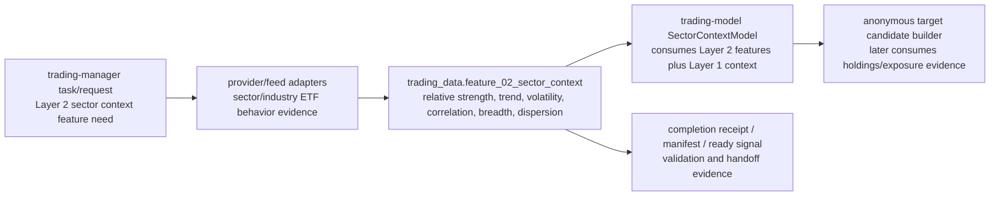

# Layer 02 - Sector Context Data

This file records the `trading-data` responsibility for Layer 2. It is intentionally narrow: model interpretation belongs to `trading-model`, and global naming authority belongs to `trading-manager`.

## Owned artifact

```text
trading_data.feature_02_sector_context
```

Layer 2 currently consumes a deterministic feature surface built from eligible sector/industry ETF market behavior. There is no accepted separate `source_02_sector_context` artifact.

## Input boundary

`feature_02_sector_context` may include point-in-time sector/industry ETF evidence for:

- relative strength;
- trend;
- volatility;
- correlation;
- breadth;
- dispersion;
- liquidity/spread/optionability support when accepted;
- event/gap/volatility/correlation diagnostics when accepted;
- freshness/missingness diagnostics.

ETF holdings and `stock_etf_exposure` are not Layer 2 core behavior inputs. They belong to `source_02_target_candidate_holdings` and the downstream anonymous target candidate builder / Layer 3 input-preparation boundary after Layer 2 has selected or prioritized baskets.

## Field naming

Raw/source columns may use clear provider or observation names without a layer prefix when they are generic facts. Layer-owned feature or model-facing keys use canonical compact prefixes when they represent Layer 2 concepts, for example `2_trend_stability_score` and `2_sector_handoff_state`. Do not introduce `layer02_*` aliases for the same concept.

## Stage flow



## Layer acceptance

Layer 2 data changes are acceptable when they:

- keep `feature_02_sector_context` as the deterministic Layer 2 feature surface;
- avoid introducing a separate `source_02_sector_context` unless a later accepted contract creates one;
- keep ETF holdings and `stock_etf_exposure` downstream in `source_02_target_candidate_holdings` / anonymous target candidate construction;
- produce point-in-time validation, row-count, provenance, and completion evidence without committing generated data or secrets;
- route new shared fields, statuses, task-key fields, source names, or feature names through `trading-manager/scripts/` before cross-repository dependence.

Current verification:

```bash
git status --short
find docs -maxdepth 1 -type f | sort
find . -maxdepth 2 -type f | sort
git diff --check
```
