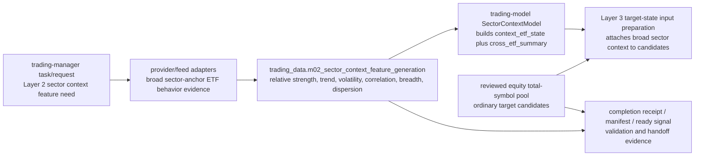

# Layer 02 - Sector Context Data

This file records the `trading-data` responsibility for Layer 2. It is intentionally narrow: model interpretation belongs to `trading-model`, and global naming authority belongs to `trading-manager`.

## Owned artifact

```text
trading_data.m02_sector_context_feature_generation
```

Layer 2 currently consumes a deterministic feature surface built from eligible broad sector-anchor ETF market behavior. There is no accepted separate sector-context source artifact.

## Input boundary

`m02_sector_context_feature_generation` may include point-in-time broad sector-anchor ETF evidence for:

- relative strength;
- trend;
- volatility;
- correlation;
- breadth;
- dispersion;
- liquidity/spread/optionability support when accepted;
- event/gap/volatility/correlation diagnostics when accepted;
- freshness/missingness diagnostics.

The reviewed Layer 2 ETF universe is restricted to the 11 broad Select Sector SPDR anchors. Focused industry-chain, theme, and special-beta ETFs are not Layer 2 sector anchors. ETF holdings and `stock_etf_exposure` are not core behavior inputs for the SectorContextModel and do not define the ordinary equity candidate universe. Ordinary candidates come from the reviewed total-symbol pool and target metadata; Layer 2 supplies broad sector context attached to those candidates.

When reviewed ETFs have mixed provider coverage, daily-derived feature families may use explicit `1Day` bars when present and fall back to the latest regular-session intraday close for dates without explicit daily bars. The fallback must remain point-in-time: current-day partial evidence may only use bars available at or before the snapshot time.

## Field naming

Raw/source columns may use clear provider or observation names without a layer prefix when they are generic facts. Layer-owned feature or model-facing keys use canonical compact prefixes when they represent Layer 2 concepts, for example `2_trend_stability_score` and `2_sector_handoff_state`. Do not introduce `layer02_*` aliases for the same concept.

## Stage flow



## Layer acceptance

Layer 2 data changes are acceptable when they:

- keep `m02_sector_context_feature_generation` as the deterministic Layer 2 feature surface;
- avoid introducing a separate sector-context source artifact without an accepted contract;
- keep ETF holdings and `stock_etf_exposure` out of the core SectorContextModel features and out of ordinary equity candidate-universe definition;
- keep focused industry/theme ETFs out of Layer 2 unless a separate reviewed proxy/theme layer is accepted;
- keep per-ETF cross-section calculations as feature/model construction evidence unless they are embedded in the accepted `context_etf_state` or promoted into a global/group `cross_etf_summary`;
- support the three target-context routing cases defined by the model contract: Layer 1 ETF target, Layer 2 context ETF target, and ordinary target with dynamic context-profile weighting;
- produce point-in-time validation, row-count, provenance, and completion evidence without committing generated data or secrets;
- route new shared fields, statuses, task-key fields, source names, or feature names through `trading-manager/scripts/` before cross-repository dependence.

Current verification:

```bash
git status --short
find docs -maxdepth 1 -type f | sort
find . -maxdepth 2 -type f | sort
git diff --check
```
